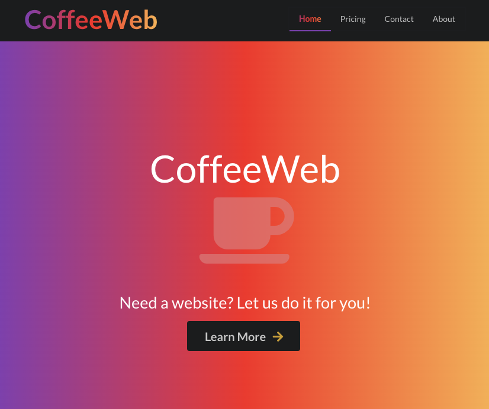

# [CoffeeWeb](http://oncoffeeweb.com/)
## NOT A REAL SITE! Built to showcase my skills!

  

* This website is built as a Fully responsive Single Page Application that uses React-Router.
* Hosted on AWS S3. 
* Also uses Semantic UI and a custom built API for the Contact Form that is hosted on Heroku

## Fork and Clone it!
Feel free to fork this repo and change its content to suit your needs!

### Notes
The Contact Form sends the information to a Rails API. You will need to create your own backend to handle the Contact form if you decide to fork this repo. 

